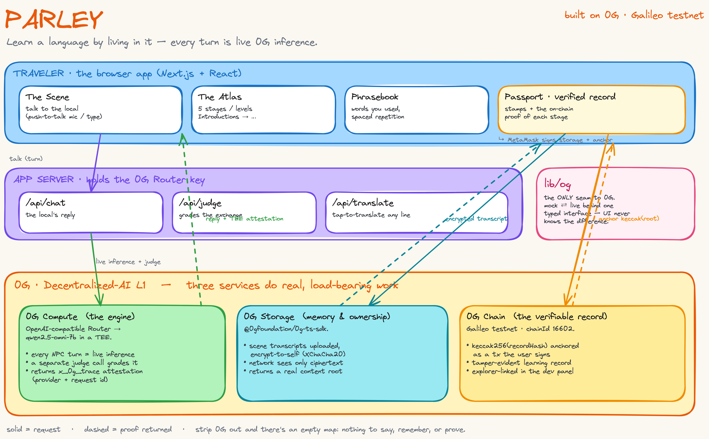

# 🗺️ Parley

*Learn a language by living in it — every word you say is answered by a real AI running on 0G.*

Parley is an explorable, illustrated risograph world where the only way forward is to **talk your way through it** — in the language you're learning — with characters who remember you. You arrive at a place, get a real goal ("buy a kilo of oranges and ask the price"), and the only way past it is to actually say it out loud. Every reply is generated by a live model on **0G Compute**, every exchange is graded by a second model call, your phrasebook and the transcript of each scene live **encrypted on 0G Storage**, and each completed stage is **anchored on 0G Chain** as a tamper-evident record. Seven languages, voice or text, all backed by decentralized AI.

Built for the **0G Zero Cup**, Parley is a game where the AI isn't a feature bolted on — it *is* the game. Remove 0G and you have an empty map with nothing to say, nothing remembered, and nothing to prove.



## ✨ Inspiration

Every flashcard app leaves the same gap wide open: **unscripted conversational production** — actually speaking, under a little pressure, in context. You can grind vocabulary for months and still freeze the first time a vendor asks "¿qué le pongo?" The thing that fixes that is a patient native speaker who will talk to you for hours, meet you at your level, and correct you in the flow — which is exactly what almost nobody has access to, and exactly what a generative model is uniquely good at being.

So the model can't be a gimmick — it has to carry the whole experience. That raised three problems a centralized chatbot can't honestly solve:

- **The "is it real?" problem** — for a learning record to mean anything (to a parent, a teacher, yourself), you need proof a real model graded you, not a number an app made up.
- **The memory problem** — the world should remember *you* across sessions, and your phrasebook should be genuinely yours and portable — not locked in someone's database.
- **The trust problem** — your transcripts and progress are personal; they shouldn't sit in plaintext on a company server.

0G is the one stack where all three are solvable at once: verifiable TEE inference, user-owned encrypted storage, and a fast L1 to anchor the proof.

## 🗣️ What It Does

Parley turns "can you actually say it?" into a game loop.

**The core loop**
- **Arrive** at an illustrated place on the Atlas — each one is a named **stage / level** (Introductions → Shopping & Numbers → Ordering Out → Times & Directions → Talking Your Way Out).
- **Read the goal** in your own language ("order a coffee the way the locals do").
- **Talk to the local** in your target language — push-to-talk voice (tap once, it listens and auto-sends when you pause) or type. The reply is a **live 0G inference** call, in character, at your level.
- **Get judged** — a separate 0G call grades the exchange: goal met? which words did you actually use? where did you slip?
- **Get corrected in-world** — if you fumble, the local recasts the right phrasing **in the target language** ("Ah, querrás decir *un kilo*, ¿verdad?"), the way a kind native would.
- **Earn the stage** — the words you used flip into your **Phrasebook** (with spaced repetition), a stamp slams into your **Passport**, and a shareable postcard prints. The next stage unlocks.

**What makes it yours and provable**
- Characters **remember you** across sessions (greetings, past stumbles) — that memory is stored on 0G.
- Your phrasebook is **yours** — encrypted to you, portable, not trapped in an app.
- Every completed stage becomes a **verifiable record**: the transcript's 0G Storage root, the grading model's TEE attestation, and an on-chain anchor — viewable, and impossible to quietly edit after the fact.

Seven languages ship today: Spanish, French, German, Italian, Hindi, Japanese, and Mandarin (non-Latin scripts include romanization and accept romanized input).

## 🧱 How We Built It

Parley is built as three layers joined by a single seam, so the world and the 0G integration could move independently.

**1. The world (browser)**
A Next.js 16 / React 19 app with a bespoke **risograph + retro-arcade** design system — split-flap departure boards, rubber-stamp rewards, an illustrated board-game Atlas, a sticker-book Phrasebook. The whole golden path is one-thumb mobile, AA-contrast, and reduced-motion friendly. Voice is the browser SpeechRecognition API (continuous, with silence auto-send); 0G STT/TTS can slot in behind the same interface.

**2. The seam (`lib/og`)**
The single boundary to 0G. Every other module calls typed functions (`chat`, `judge`, `savePlayer`, `saveSceneTranscript`, `anchor`, …) and **nothing else imports a 0G SDK**. Compute, Storage, and Chain each toggle between a **mock** implementation (canned + local, so the whole game plays offline with zero network) and the **live** 0G implementation — behind the exact same signatures. The UI never knows which is running. This is what let us build the entire experience first and drop real 0G in without touching a screen.

**3. The engine (`lib/engine`)**
Pure tutor logic — NPC prompt construction, the two-call turn-then-judge flow, correction folding, difficulty adaptation, and an SM-2 spaced-repetition scheduler. No 0G, no UI imports.

**The three 0G services do load-bearing work:**
- **0G Compute** — every NPC turn is a live inference call to `qwen/qwen2.5-omni-7b` (TEE-attested) through 0G's OpenAI-compatible Router. A separate *judge* call returns structured JSON (goal met, fluency, corrections, words used). There is no scripted dialogue tree. Each response carries `x_0g_trace` — the compute provider address + request id — which becomes the record's attestation.
- **0G Storage** — scene transcripts are uploaded via `@0gfoundation/0g-ts-sdk` with **true encrypt-to-self**: a key derived from a one-time wallet signature, XChaCha20-Poly1305, so the network only ever sees ciphertext. The upload returns a real content root.
- **0G Chain** — on stage completion, `keccak256(recordHash)` is anchored as a transaction the user signs on **0G Galileo testnet (chainId 16602)**, making the learning record tamper-evident. Tx hashes are surfaced in an in-app dev panel, explorer-linked.

The most important design decision: **`lib/og` is the only thing that touches 0G**, and the server holds the Router key while Storage/Chain are signed client-side — so the app is trust-minimized and the user owns their own data and keys.

## 🛠️ Tech Stack

- **Frontend:** Next.js 16 (App Router), React 19, TypeScript, Tailwind v4, Framer Motion
- **0G Compute:** OpenAI-compatible Router (`qwen/qwen2.5-omni-7b`, TEE / `x_0g_trace` attestation), runtime model discovery
- **0G Storage:** `@0gfoundation/0g-ts-sdk` (Indexer upload + content roots), client-side encryption with `@noble/ciphers` (XChaCha20-Poly1305)
- **0G Chain:** 0G Galileo testnet (chainId 16602), `ethers` v6 (`BrowserProvider` + MetaMask), keccak256 anchor
- **Voice:** browser SpeechRecognition (push-to-talk, silence auto-send) + `speechSynthesis`
- **Audio:** synthesized WebAudio SFX + ambient (off by default, autoplay-safe)
- **Learning:** SM-2 spaced repetition, per-language content scripts, in-language corrective recast

## 🔌 How We Use 0G

**0G Compute — the engine**
- Every single NPC turn is a live Router inference call; remove it and the characters have nothing to say.
- A second *judge* call grades each exchange into structured JSON — this is the home of the verifiable attestation (`x_0g_trace`: provider + request id), and it's what the Passport's "verified record" points to.
- A `/api/translate` route does live, on-demand translation of any line the model produces (tap-to-translate), for all seven languages.
- Models are discovered at runtime (`GET /v1/models`) and a chat model is selected — never hard-coded.

**0G Storage — memory & ownership**
- Completed-scene transcripts (the substance the verified record references) are uploaded encrypted-to-self, returning a real content root.
- This is what makes the world *remember you* and your phrasebook *portable* — properties a stateless app structurally cannot have.

**0G Chain — the verifiable record**
- Each completed stage anchors `keccak256(recordHash)` in a user-signed tx on Galileo testnet — a tamper-evident credential combining the storage root + the model's TEE attestation.
- Anchors are explorer-linked in the dev panel so you can watch the on-chain activity live.

> **Honesty note:** the verified record proves the *integrity of the record and that a real, attested model graded it* — not that the work was unaided. We don't overclaim.

## 🔍 Verify the 0G claims (for judges)

Don't take our word for it — every claim maps to code:

| Claim | Where | Quick check |
|---|---|---|
| Live inference per turn | `lib/og/compute.ts` (`liveChat`/`liveJudge`) | `grep -rn x_0g_trace lib/og` · in-app: the pine "answered live on 0G" chip + request ids in the dev panel |
| Encrypt-to-self storage | `lib/og/storage.ts` (`encryptJson`/`uploadBytes`/`downloadTranscript`) | `grep -rn xchacha20poly1305 lib/og` |
| On-chain anchor | `lib/og/chain.ts` (`anchor`) | `grep -rn keccak lib/og/chain.ts` · completed-scene tx on `chainscan-galileo.0g.ai` |
| 0G is the only seam | `lib/og/index.ts` | nothing else imports a 0G SDK (`grep -rn "0g-ts-sdk" --include=*.ts | grep -v lib/og`) |

See **[JUDGE.md](JUDGE.md)** for a step-by-step verification guide and **[ARCHITECTURE.md](ARCHITECTURE.md)** for the layer-by-layer breakdown. A 60-second demo script is in **[DEMO.md](DEMO.md)**.

## 📚 What We Learned

- **Designing a seam pays for itself.** Putting every 0G call behind one typed `lib/og` interface — with mock and live implementations that toggle independently per service — meant the entire game was playable offline on day one, and swapping in real testnet Compute, Storage, and Chain never touched a single screen.
- **What belongs on-chain vs. off.** Raw transcripts and the model's reasoning stay encrypted in Storage / sealed in the TEE; only the verdict's attestation and a hash anchor go on-chain. Reasoning about that privacy boundary reshaped the whole record design.
- **Live inference is a UX material.** Real testnet latency (~3–6s/turn) changes how a conversation should *feel* — the "thinking…" beat, optimistic UI, and the two-call turn/judge split all came out of designing around real inference instead of a mock.
- **Decentralized AI made the pitch honest.** "An AI graded you and you can prove it" is only true because the grade came from a TEE-attested model and its fingerprint is anchored on-chain.

## 🚀 Setup

```bash
npm install
npm run dev        # http://localhost:3000
```

**Default (`OG_MODE=mock`)** — the whole golden path (Arrival → Atlas → Scene → reward → Passport) plays with no network or wallet: canned dialogue in all seven languages + local storage.

**Live 0G** — copy `.env.example` → `.env.local` and set:

```bash
OG_COMPUTE_MODE=live
OG_ROUTER_BASE_URL=https://router-api-testnet.integratenetwork.work/v1
OG_ROUTER_API_KEY=sk-...        # from pc.testnet.0g.ai, funded via faucet.0g.ai
OG_CHAT_MODEL=qwen/qwen2.5-omni-7b

# opt-in, client-side, require MetaMask on 0G Galileo testnet (chainId 16602):
NEXT_PUBLIC_OG_STORAGE_MODE=live
NEXT_PUBLIC_OG_CHAIN_MODE=live
```

Each inference call costs ~0.00003 0G on testnet. The three layers (Compute / Storage / Chain) toggle independently, so you can run live inference with mock persistence for a smooth no-wallet demo.

**Architecture diagram** — regenerate with `python3 docs/diagrams/gen_architecture.py` (source `.excalidraw` + generator live in `docs/diagrams/`).

## 📄 License & author

MIT — see [LICENSE](LICENSE). Built by **Nischay Rawal** ([@LegendaryPenguin](https://github.com/LegendaryPenguin)) for the **0G Zero Cup**.

---

Built on **0G** — Compute for the conversation, Storage for the memory, Chain for the proof. 🗺️
